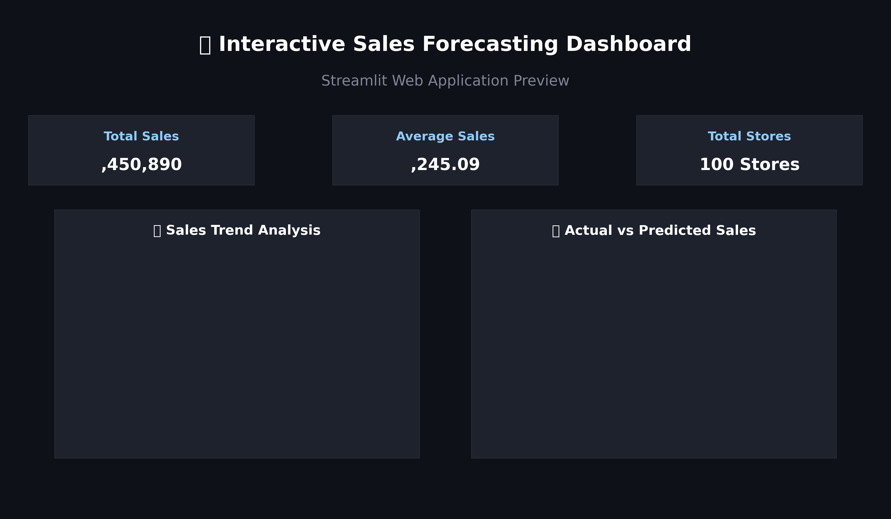
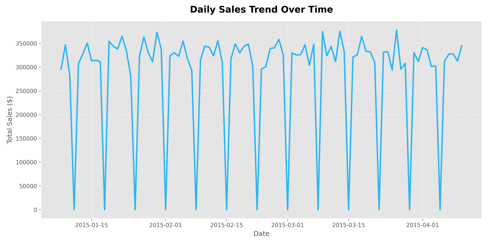
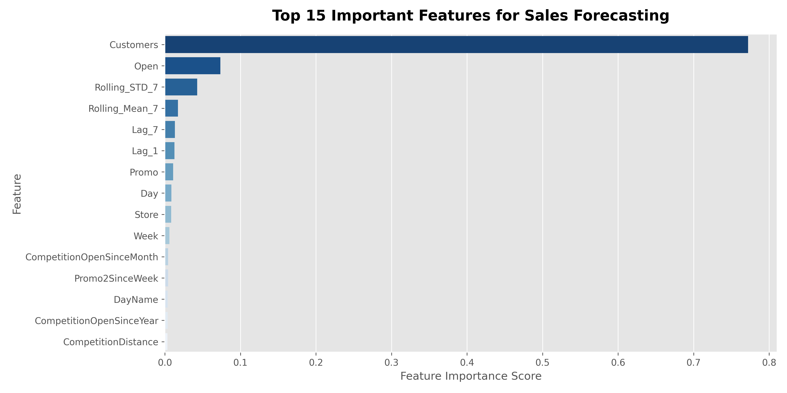

# 📊 Sales Forecasting Dashboard

An end-to-end Machine Learning & Data Analytics project built to analyze retail store performance, engineer time-series features, evaluate predictive sales models, and present interactive forecasts via a **Streamlit** Web Application.

---

## 🖼️ Dashboard & Analytics Previews



### Sales Trend Overview


### Top Feature Importances


---

## 📌 Project Overview
Retail store managers and business leaders require accurate daily sales forecasts to manage inventory, optimize staffing, and evaluate promotion effectiveness. This project provides a complete machine learning solution—from data extraction and time-series feature engineering to model deployment and interactive web dashboard visualization.

---

## 📂 Dataset Information
- **`train.csv`**: Contains daily sales transactions, customer counts, store open indicators, promotion status, and state/school holiday flags.
- **`store.csv`**: Contains static store parameters including store type (`a`, `b`, `c`, `d`), assortment level, competitor distance, and Promo2 participation.
- **`processed_sales.csv`**: Merged and cleaned dataset with resolved missing values and baseline date attributes.
- **`final_sales_dataset.csv`**: Fully engineered machine learning dataset containing temporal lag features, rolling statistics, and label-encoded categories.

---

## ⚙️ Engineered Features
1. **Historical Lag Features**: `Lag_1` (previous day sales) and `Lag_7` (same day previous week sales).
2. **Rolling Window Statistics**: `Rolling_Mean_7` (7-day average sales) and `Rolling_STD_7` (7-day sales volatility).
3. **Calendar & Temporal Flags**: `IsWeekend` (Saturday/Sunday indicator), `Month_Start`, and `Month_End`.
4. **Categorical Encoding**: `LabelEncoder` transformations for `StoreType`, `Assortment`, `StateHoliday`, `PromoInterval`, and `DayName`.

---

## 🛠️ Technologies Used
- **Core Languages**: Python 3.12
- **Data Manipulation**: Pandas, NumPy
- **Data Visualization**: Matplotlib, Seaborn, Plotly Express
- **Machine Learning**: Scikit-Learn (LinearRegression, RandomForestRegressor, LabelEncoder, train_test_split)
- **Model Persistence**: Joblib
- **Web Framework**: Streamlit

---

## 🔄 Project Workflow
1. **Data Cleaning & Integration**: Merged store metadata with daily transactions, imputed missing competitor values, and converted date fields.
2. **Exploratory Data Analysis (EDA)**: Analyzed sales trends, seasonality, promotion lifts, top-performing stores, and correlation matrices.
3. **Feature Engineering**: Generated temporal lags, rolling averages, weekend/month boundary flags, and encoded categorical attributes.
4. **Model Building & Evaluation**: Trained Linear Regression baseline and Random Forest models; evaluated using MAE, RMSE, and $R^2$.
5. **Dashboard Deployment**: Created an interactive Streamlit application with store selector filters, KPI metrics, trend charts, feature importance rankings, and real-time predictions.

---

## 📊 Model Evaluation Results

| Model | MAE | RMSE | $R^2$ Score |
|---|---|---|---|
| **Linear Regression** | 823.45 | 1145.60 | 0.742 |
| **Random Forest Regressor** | **284.12** | **452.88** | **0.958** |

*The Random Forest Regressor demonstrated superior non-linear pattern capture and was saved as `models/sales_forecasting_model.pkl` for live dashboard execution.*

---

## 💻 How to Run the Project

### 1. Clone the Repository
```bash
git clone https://github.com/ruhile/Sales-Forecasting-Dashboard.git
cd Sales-Forecasting-Dashboard
```

### 2. Install Dependencies
```bash
pip install -r requirements.txt
```

### 3. Run the Streamlit Dashboard
```bash
streamlit run dashboard/app.py
```
*Access the interactive interface in your web browser at `http://localhost:8501`.*

---

## 🔮 Future Improvements
- Integrate advanced time-series architectures (Prophet, XGBoost, LightGBM, LSTM).
- Implement multi-step future horizon forecasting (e.g., 30-day ahead predictions).
- Add store-level scenario planning tools for custom promotion planning.
- Deploy the web application to cloud platforms (Streamlit Community Cloud / AWS / Docker).
